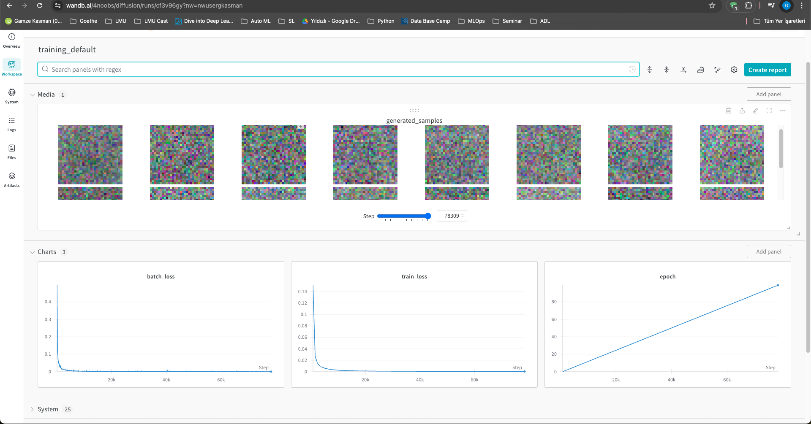
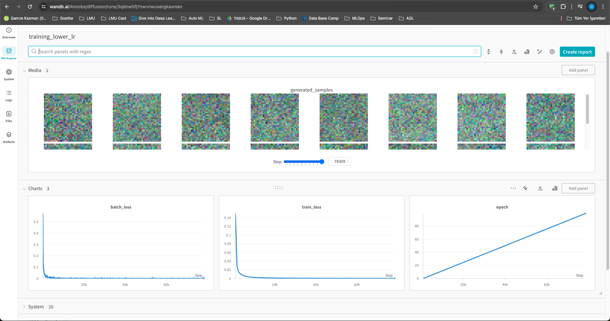
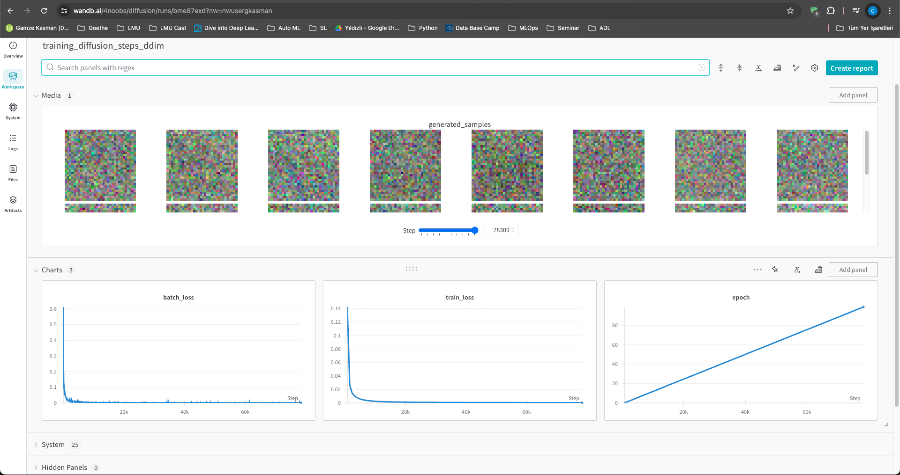
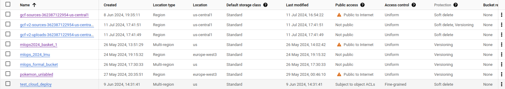
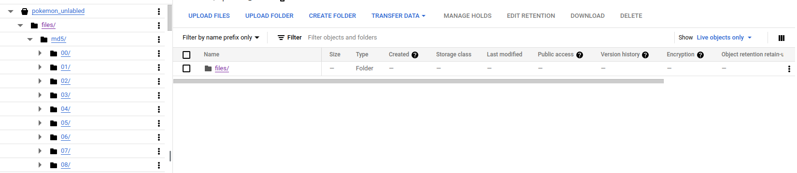
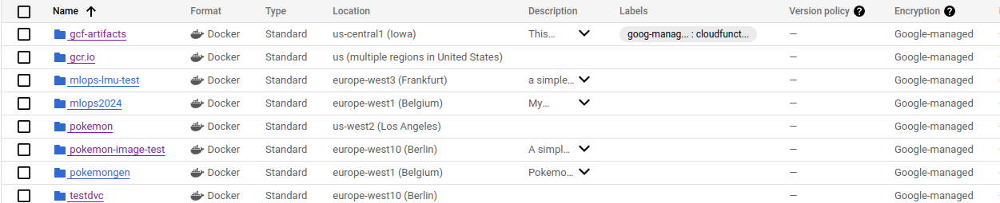
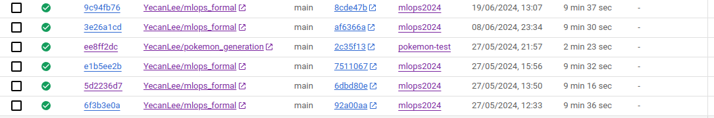

# Exam template for 02476 Machine Learning Operations

This is the report template for the exam. Please only remove the text formatted as with three dashes in front and behind
like:

```--- question 1 fill here ---```

where you instead should add your answers. Any other changes may have unwanted consequences when your report is auto
generated in the end of the course. For questions where you are asked to include images, start by adding the image to
the `figures` subfolder (please only use `.png`, `.jpg` or `.jpeg`) and then add the following code in your answer:

```markdown

```

In addition to this markdown file, we also provide the `report.py` script that provides two utility functions:

Running:

```bash
python report.py html
```

will generate an `.html` page of your report. After deadline for answering this template, we will autoscrape
everything in this `reports` folder and then use this utility to generate an `.html` page that will be your serve
as your final handin.

Running

```bash
python report.py check
```

will check your answers in this template against the constrains listed for each question e.g. is your answer too
short, too long, have you included an image when asked to.

For both functions to work it is important that you do not rename anything. The script have two dependencies that can
be installed with `pip install click markdown`.

## Overall project checklist

The checklist is *exhaustic* which means that it includes everything that you could possible do on the project in
relation the curricilum in this course. Therefore, we do not expect at all that you have checked of all boxes at the
end of the project.

### Week 1

* [x] Create a git repository
* [x] Make sure that all team members have write access to the github repository
* [x] Create a dedicated environment for you project to keep track of your packages
* [x] Create the initial file structure using cookiecutter
* [x] Fill out the `make_dataset.py` file such that it downloads whatever data you need and
* [x] Add a model file and a training script and get that running
* [x] Remember to fill out the `requirements.txt` file with whatever dependencies that you are using
* [x] Remember to comply with good coding practices (`pep8`) while doing the project
* [x] Do a bit of code typing and remember to document essential parts of your code
* [x] Setup version control for your data or part of your data
* [x] Construct one or multiple docker files for your code
* [x] Build the docker files locally and make sure they work as intended
* [x] Write one or multiple configurations files for your experiments
* [x] Used Hydra to load the configurations and manage your hyperparameters
* [x] When you have something that works somewhat, remember at some point to to some profiling and see if
      you can optimize your code
* [x] Use Weights & Biases to log training progress and other important metrics/artifacts in your code. Additionally,
      consider running a hyperparameter optimization sweep.
* [x] Use Pytorch-lightning (if applicable) to reduce the amount of boilerplate in your code

### Week 2

* [x] Write unit tests related to the data part of your code
* [x] Write unit tests related to model construction and or model training
* [x] Calculate the coverage.
* [x] Get some continuous integration running on the github repository
* [x] Create a data storage in GCP Bucket for you data and preferable link this with your data version control setup
* [x] Create a trigger workflow for automatically building your docker images
* [x] Get your model training in GCP using either the Engine or Vertex AI
* [x] Create a FastAPI application that can do inference using your model
* [x] If applicable, consider deploying the model locally using torchserve
* [x] Deploy your model in GCP using either Functions or Run as the backend

### Week 3

* [x] Check how robust your model is towards data drifting
* [x] Setup monitoring for the system telemetry of your deployed model
* [x] Setup monitoring for the performance of your deployed model
* [x] If applicable, play around with distributed data loading
* [x] If applicable, play around with distributed model training
* [x] Play around with quantization, compilation and pruning for you trained models to increase inference speed

### Additional

* [x] Revisit your initial project description. Did the project turn out as you wanted?
* [x] Make sure all group members have a understanding about all parts of the project
* [x] Uploaded all your code to github

## Group information

### Question 1
>
> **Enter the group number you signed up on <learn.inside.dtu.dk>**
>
> Answer:

Michael Sawitzki\
Meimingwei Li\
Luis Karrlein\
Gamze G. Kasman

### Question 2
>
> **Enter the study number for each member in the group**
>
> Example:
>
> *sXXXXXX, sXXXXXX, sXXXXXX*
>
> Answer:

Michael Sawitzki: &emsp;                  12150362\
Meimingwei Li:    &emsp;&emsp;            12672582\
Luis Karrlein:    &emsp;&emsp;&emsp;      12285004\
Gamze G. Kasman:  &emsp;                  12691013

### Question 3
>
> **What framework did you choose to work with and did it help you complete the project?**
>
> Recommended answer length: 100-200 words.
>
> Example:
> *We used the third-party framework ... in our project. We used functionality ... and functionality ... from the*
> *package to do ... and ... in our project*.
>
> Answer:

In our project, we utilized a robust set of frameworks and tools to streamline the machine learning lifecycle, ensuring our workflow was efficient, reproducible, and scalable.

We used **PyTorch** as the backbone of our code, providing the computational engine and the data structures necessary for defining our models. To enhance our PyTorch workflow, we employed **PyTorch Lightning**, which offers a high-level interface with features like logging, checkpointing, early stopping, and support for multi-GPU and multi-node training.

**Conda** was essential for managing dependencies and creating reproducible virtual environments. For configuration management, we used **Hydra**, which allowed us to define hierarchical configuration structures through config files.

For experiment tracking and logging, we relied on **Weights and Biases (Wandb)**, which helped us track hyperparameters and results comprehensively. Whenever we encountered performance bottlenecks, we utilized a **Profiler** to diagnose and resolve these issues efficiently. **Debugging** tools were also crucial for identifying and fixing bugs in our code.

**Cookiecutter** was used for organizing our code and creating standardized project templates. For containerization, **Docker** played a critical role by encapsulating our development environment and dependencies, ensuring consistency across different deployment platforms.

**Data Version Control (DVC)** was used for managing data versions and synchronizing between local and remote storage. For version control of our code, we used **Git** in combination with **GitHub**, facilitating collaboration among multiple developers. **Pytest** was employed to write unit tests, ensuring new changes did not break the codebase.

The highly personalizable **Ruff** linter and formatter forced us to conform to a consistent coding style. **GitHub Actions** automated our continuous integration processes, running tests and checks upon each commit. **Cloud Build** automated the building and pushing of Docker images to our **Artifact Registry**, making deployment more efficient.

For deployment, **FastAPI** was used to create REST APIs, and **Cloud Run** enabled us to deploy these APIs in a serverless manner. **Cloud Storage** provided scalable storage for our data and models, and **Compute Engine** offered the necessary compute power. For scalable and easy model training, we used **Vertex AI**. **Cloud Monitoring** helped us track logs and errors from our cloud services.

## Coding environment

> In the following section we are interested in learning more about you local development environment.

### Question 4

> **Explain how you managed dependencies in your project? Explain the process a new team member would have to go**
> **through to get an exact copy of your environment.**
>
> Recommended answer length: 100-200 words
>
> Example:
> *We used ... for managing our dependencies. The list of dependencies was auto-generated using ... . To get a*
> *complete copy of our development environment, one would have to run the following commands*
>
> Answer:

Subfolders of our project come as python packages and are installable with the use of setuptools. The package dependencies we used, along with their required versions, can be read from the requirements.txt file and easily installed locally. Specifying the version numbers of the packages was important because we encountered bugs with newer versions of some packages, such as dvc. In the pyproject.toml, we also specified the required python version, which is checked by setuptools upon installing the package. A new group member would just have to install a compatible python version and then the package, which in turn installs all necessary dependencies, before they could also work on the project.

### Question 5

> **We expect that you initialized your project using the cookiecutter template. Explain the overall structure of your**
> **code. Did you fill out every folder or only a subset?**
>
> Recommended answer length: 100-200 words
>
> Example:
> *From the cookiecutter template we have filled out the ... , ... and ... folder. We have removed the ... folder*
> *because we did not use any ... in our project. We have added an ... folder that contains ... for running our*
> *experiments.*
> Answer:

We decided to use the new version of the Cookiecutter Data Science template (version 2.0) as we deemed it to have a clearer structure than the previous version. We however did not strictly adhere to the default structure of the template, instead we removed some folders and files that we deemed unnecessary. Most notably, we needed to remove the data folder because we used DVC for version control of our dataset. We also added some folders, such as a folder containing most of the functionality needed for our model.

### Question 6

> **Did you implement any rules for code quality and format? Additionally, explain with your own words why these**
> **concepts matters in larger projects.**
>
> Recommended answer length: 50-100 words.
>
> Answer:

We added linting checks that are triggered every time a new pull request is created. For this purpose we used the ruff linter. We also used the ruff package to format our code as it includes a formatter. To configure ruff globally for our team, we added the linting and formatting rules to the pyproject.toml file.

## Version control

> In the following section we are interested in how version control was used in your project during development to
> corporate and increase the quality of your code.

### Question 7

> **How many tests did you implement and what are they testing in your code?**
>
> Recommended answer length: 50-100 words.
>
> Example:
> *In total we have implemented X tests. Primarily we are testing ... and ... as these the most critical parts of our*
> *application but also ... .*
>
> Answer:

We implemented seven tests in total. 
- `test_data.py` checks if both the Torch and Huggingface datasets are created properly, including train/test/val splits and tensor shapes for the Torch dataset. It also verifies the dataset length and ensures 'image' and 'text' keys exist in all splits for the Huggingface dataset. 
- `test_ddpm_checkpoint.py`: verifies that the DDPM model can save and load checkpoints during training. It ensures that the model's state dictionaries match before and after loading, and that training can resume correctly without errors.
- `test_ddpm_conditioning.py` checks if the DDPM model handles conditioning correctly, ensuring consistent output with the conditioned input. 
- `test_ddpm_initialization.py` verifies the initialization of the DDPM model with various configurations. It ensures that the model can handle different setups and that a forward pass with dummy data produces an expected output.
- `test_ddpm_model.py` ensures the DDPM model can process input data through its forward pass. It verifies that the model produces the expected output shape, confirming its functional integrity.
- `test_ddpm_saving_loading.py` ensures that the saved model state can be loaded into a new model instance. It verifies that the new instance produces the same output as the original model, ensuring consistency in model persistence and retrieval.
- `test_ddpm_training.py` verifies that the DDPM model's loss calculation works as expected. It ensures that training updates the model's parameters correctly, maintaining the integrity of the training process.
- `test_latent_diffusion.py` checks the functionality of the Latent Diffusion model, including model initialization, forward pass, sampling, and loss calculation. It ensures that the model behaves as expected and integrates well with the DDPM model.

### Question 8

> **What is the total code coverage (in percentage) of your code? If you code had an code coverage of 100% (or close**
> **to), would you still trust it to be error free? Explain you reasoning.**
>
> Recommended answer length: 100-200 words.
>
> Example:
> *The total code coverage of code is X%, which includes all our source code. We are far from 100% coverage of our **
> *code and even if we were then...*
>
> Answer:

Our current code coverage for this course project is 31%. While this shows that a portion of our code is covered by tests, it is important to consider the context of a course project. In educational settings, the emphasis is often on learning and understanding concepts rather than achieving high production-level metrics like code coverage.

Nevertheless, striving to increase our coverage beyond 31% would still be beneficial. It allows us to practice writing more comprehensive tests, which can help in identifying and fixing potential issues earlier in the development process. This approach not only improves our understanding of testing methodologies but also contributes to producing more reliable and robust software, which is valuable even in a course project context.

### Question 9

> **Did you workflow include using branches and pull requests? If yes, explain how. If not, explain how branches and**
> **pull request can help improve version control.**
>
> Recommended answer length: 100-200 words.
>
> Example:
> *We made use of both branches and PRs in our project. In our group, each member had an branch that they worked on in*
> *addition to the main branch. To merge code we ...*
>
> Answer:

Because we are multiple people, it was important for us to work on different branches to make our changes reproducible and avoid conficting changes. Every time a team member wanted to make a change to the main branch of our project, they had to create a pull request. We also used this step to run tests to see if the new changes are compatible with the existing code. Following the DevOps mantra of continuous integration we used github actions, that are triggered every time we create a pull request, to lint and test the code.

### Question 10

> **Did you use DVC for managing data in your project? If yes, then how did it improve your project to have version**
> **control of your data. If no, explain a case where it would be beneficial to have version control of your data.**
>
> Recommended answer length: 100-200 words.
>
> Example:
> *We did make use of DVC in the following way: ... . In the end it helped us in ... for controlling ... part of our*
> *pipeline*
>
> Answer:

We used Google Cloud Storage for our DVC-based storage. Initially, we only had raw images of Pokémon. To train our model, we generated captions for these images using BLIP2, saving the captions in a JSONL file. For creating a Huggingface dataset with both images and captions, and for the train/test/val split, we placed the images and JSONL captions into their respective train, test, and validation folders in the data directory.
DVC allowed us to experiment with the dataset creation. We could move the images between folders without disrupting the data structure, and a simple `dvc pull` let us reset any changes and try again if something didn't work properly. Additionally, DVC enabled us to include data testing in our workflow. We could use `dvc pull` in our GitHub Actions workflow files to fetch the data needed for automated tests.

Our continuous integration (CI) setup is designed to ensure robust code quality and functionality through automated testing, linting, and data validation. We have organized our CI into three main workflows: `cml_data.yaml`, `lint.yaml`, and `testing.yaml`.

#### Data Validation Workflow (`cml_data.yaml`)

This workflow is triggered on pull requests and focuses on data validation. The steps involved are:

1. **Check Out the Code**: Retrieves the latest code from the repository.
2. **Set Up Python**: Configures the Python environment.
3. **Install Dependencies**: Installs necessary dependencies for the project.
4. **Pull Data Using DVC**: Downloads the data required for validation.
5. **Generate Data Statistics Report**: Creates a report summarizing the data statistics.
6. **Comment on Pull Request**: Posts a summary of the data validation results on the pull request.

This ensures that any changes to the data are tracked and validated before merging.

#### Linting Workflow (`lint.yaml`)

Our linting workflow ensures that the code adheres to specified style guidelines. This workflow runs on every push and pull request to the main branch. The steps involved are:

1. **Check Out the Code**: Retrieves the latest code from the repository.
2. **Set Up Python**: Configures the Python environment.
3. **Install Dependencies**: Installs necessary linting tools.
4. **Run Linting**: Executes linting checks to enforce code quality standards.

[Link to lint.yaml](https://github.com/LuuisK/pokemon_generation/blob/main/.github/workflows/lint.yaml)

#### Testing Workflow (`testing.yaml`)

This workflow is responsible for running unit tests to ensure code functionality. It is triggered on every push and pull request. The steps involved are:

1. **Check Out the Code**: Retrieves the latest code from the repository.
2. **Set Up Python**: Configures the Python environment with multiple Python versions.
3. **Install Dependencies**: Installs project dependencies and testing tools.
4. **Run Tests**: Executes the test suite to verify code correctness.

[Link to testing.yaml](https://github.com/LuuisK/pokemon_generation/blob/main/.github/workflows/testing.yaml)

By separating our CI into these workflows, we ensure a modular and efficient process for maintaining code quality and integrity across different aspects of the project.

### Question 12

> **How did you configure experiments? Did you make use of config files? Explain with coding examples of how you would**
> **run a experiment.**
>
> Recommended answer length: 50-100 words.
>
> Example:
> *We used a simple argparser, that worked in the following way: python my_script.py --lr 1e-3 --batch_size 25*
>
> Answer:

We used Hydra for configuring our experiments, which allowed us to dynamically load and merge configuration files. This setup provided flexibility in managing hyperparameters and other configurations without modifying the code. For instance, we have a default configuration file (`config.yaml`) and additional configuration files for different experiments, such as `lower_lr.yaml` for experimenting with a lower learning rate and `sgd.yaml` for using the SGD optimizer.

To run an experiment with a different configuration, we used the following command:

```bash
python src/modeling/train_ddpm_example.py --config-name config +training_params=lower_lr
```

or for the SGD optimizer:

```bash
python src/modeling/train_ddpm_example.py --config-name config +optimizer=sgd
```

### Question 13

> **Reproducibility of experiments are important. Related to the last question, how did you secure that no information**
> **is lost when running experiments and that your experiments are reproducible?**
>
> Recommended answer length: 100-200 words.
>
> Example:
> *We made use of config files. Whenever an experiment is run the following happens: ... . To reproduce an experiment*
> *one would have to do ...*
>
> Answer:

We made extensive use of configuration files to ensure reproducibility. Each experiment's configuration was defined in YAML files, which were version-controlled using Git. This approach ensured that all changes to the configurations were tracked and could be reviewed or reverted if necessary.

Whenever an experiment is run, the following happens:

1. **Configuration Management**: The base configuration file (`config.yaml`) is loaded, and additional configuration files (e.g., `lower_lr.yaml`, `sgd.yaml`) are merged as specified through command-line overrides.
2. **Logging with W&B**: Weights and Biases (W&B) was used to log all experiment details, including hyperparameters, training metrics, and model artifacts. This ensured that all aspects of the experiments were recorded and could be accessed later.
3. **Hydra's Logging**: Hydra's built-in logging capabilities were used to save the final merged configuration for each experiment. This saved configuration file included all the parameters used, ensuring that the exact settings could be replicated.

To reproduce an experiment, one would:

1. **Checkout the Git Commit**: Ensure that you are on the same commit of the codebase that was used for the experiment.
2. **Use the Same Configuration**: Run the experiment with the same configuration files and command-line overrides used initially. For example:
```bash
python src/modeling/train_ddpm_example.py --config-name config +diffusion_steps=ddim
```
3. **Review W&B Logs**: Refer to the logs and metrics stored in W&B to verify the results and compare them against the new run.

### Question 14

> **Upload 1 to 3 screenshots that show the experiments that you have done in W&B (or another experiment tracking**
> **service of your choice). This may include loss graphs, logged images, hyperparameter sweeps etc. You can take**
> **inspiration from [this figure](figures/wandb.png). Explain what metrics you are tracking and why they are**
> **important.**
>
> Recommended answer length: 200-300 words + 1 to 3 screenshots.
>
> Example:
> *As seen in the first image when have tracked ... and ... which both inform us about ... in our experiments.*
> *As seen in the second image we are also tracking ... and ...*
>
> Answer:

In our experiments tracked using Weights & Biases (W&B), we focused on several key metrics:

1. **Training Loss**: This metric is crucial for understanding how well the model is learning from the training data over time. A decreasing training loss indicates that the model is improving.
2. **Validation Loss**: This helps us monitor the model's performance on unseen data, ensuring it is not overfitting to the training data.
3. **Learning Rate**: By logging the learning rate, we can analyze its impact on the training dynamics and make adjustments if necessary.
4. **Generated Samples**: Periodically logging generated samples allows us to visually inspect the quality of the images produced by the model during training.

These metrics provide a comprehensive overview of the model's training process and performance, enabling us to make informed decisions to improve the model.

As seen in the images below, we tracked these metrics across different experimental configurations:

#### Default Run
In this default run, we tracked the model's performance using the initial configurations. This provided a baseline to compare against other experimental setups.



#### Lower Learning Rate
In this experiment, we adjusted the learning rate to observe its effect on the training process. A lower learning rate can lead to more stable training but may require more epochs to converge.



#### Diffusion Steps
Here, we experimented with changing the number of diffusion steps. This parameter affects the granularity of the model's denoising process, influencing the quality of generated samples.



### Question 15

> **Docker is an important tool for creating containerized applications. Explain how you used docker in your**
> **experiments? Include how you would run your docker images and include a link to one of your docker files.**
>
> Recommended answer length: 100-200 words.
>
> Example:
> *For our project we developed several images: one for training, inference and deployment. For example to run the*
> *training docker image: `docker run trainer:latest lr=1e-3 batch_size=64`. Link to docker file: <weblink>*
>
> Answer:

For our project, we developed multiple Docker images to facilitate different stages of our workflow, including training, inference, and deployment. Docker was instrumental in ensuring a consistent environment across various stages and different machines. We used specific Dockerfiles tailored for each task to encapsulate the necessary dependencies and configurations.

To run the training Docker image, we used the following command:

```bash
docker run --gpus all -e WANDB_API_KEY=YOUR_WANDB_KEY fd_train:latest
```

This command ensures the use of GPU resources, sets up the necessary environment variables for logging with Weights and Biases, and executes the training process within the container.

Additionally, we built Docker images for data testing to ensure the correct functioning of DVC (Data Version Control) and for deployment via Google Cloud Run. Here is the link to one of our Dockerfiles used for training: Dockerfile for Training.

By utilizing Docker, we achieved reproducibility, streamlined deployment, and isolated environments, which significantly enhanced our development and deployment workflow.

- [Dockerfile for Data Testing](https://github.com/LuuisK/pokemon_generation/blob/main/datatest.dockerfile)
- [Dockerfile for DVC Data](https://github.com/LuuisK/pokemon_generation/blob/main/dvcdata.dockerfile)
- [Dockerfile for Google Cloud Run](https://github.com/LuuisK/pokemon_generation/blob/main/gcloudrun.dockerfile)
- [Dockerfile for Stable Diffusion Fine-tuning](https://github.com/LuuisK/pokemon_generation/blob/main/sd_finetune.dockerfile)
- [Dockerfile for Test Trainer](https://github.com/LuuisK/pokemon_generation/blob/main/test_trainer.dockerfile)

### Question 16

> **When running into bugs while trying to run your experiments, how did you perform debugging? Additionally, did you**
> **try to profile your code or do you think it is already perfect?**
>
> Recommended answer length: 100-200 words.
>
> Example:
> *Debugging method was dependent on group member. Some just used ... and others used ... . We did a single profiling*
> *run of our main code at some point that showed ...*
>
> Answer:

When running into bugs during our experiments, we performed debugging by utilizing print statements to trace the flow of execution and identify where issues occurred. Additionally, we used tools like `pytest` to run test files and ensure the code was functioning as expected. Some parts of our debugging process involved checking and fixing paths inside different test files to ensure they pointed to the correct locations.

Regarding profiling, we worked on profiling and corresponding acceleration methods to optimize our code's performance. One of the ideas we implemented was to create a slower version of inference deliberately, play with the profiler, and then make it faster later. This involved experimenting with inefficient memory behavior first, such as using `.to(device)` instead of specifying `device=device`.

For Docker-specific issues, we implemented a thorough debugging process. This included checking existing Docker images with `docker images` and removing unnecessary ones using `docker rmi IMAGE_ID`. If issues with deleting images arose, we used commands like `docker rm numbers` or `docker rmi numbers`. Additionally, we ensured proper GPU support by checking NVIDIA drivers and CUDA toolkit availability using `nvidia-smi` and `nvcc --version`. If further issues persisted, we installed additional tools using:

```bash
distribution=$(. /etc/os-release;echo $ID$VERSION_ID)
curl -s -L https://nvidia.github.io/nvidia-docker/gpgkey | sudo apt-key add -
curl -s -L https://nvidia.github.io/nvidia-docker/$distribution/nvidia-docker.list | sudo tee /etc/apt/sources.list.d/nvidia-docker.list
sudo apt-get update
sudo apt-get install -y nvidia-docker2
sudo systemctl restart docker
```
These debugging and profiling efforts helped us identify bottlenecks and improve the efficiency and correctness of our code.

## Working in the cloud

> In the following section we would like to know more about your experience when developing in the cloud.

### Question 17

> **List all the GCP services that you made use of in your project and shortly explain what each service does?**
>
> Recommended answer length: 50-200 words.
>
> Example:
> *We used the following two services: Engine and Bucket. Engine is used for... and Bucket is used for...*
>
> Answer:

We used the following GCP services in our project:

1. **Google Cloud Storage (GCS)**: We used GCS as our data remote storage for DVC (Data Version Control). This allowed us to manage and version our dataset efficiently.

2. **Google Cloud Run**: Cloud Run was used to deploy our trained model as a web service. This service allows us to run containerized applications in a fully managed environment, facilitating easy scaling and management of our deployment.

3. **Google Compute Engine**: Compute Engine was utilized to create instances with Nvidia T4 GPUs for training our models. This service provided the necessary computational resources for our training tasks.

4. **Google Artifact Registry**: This service was used to store and manage our Docker images. We built Docker images and pushed them to the Artifact Registry for deployment on Cloud Run.

These GCP services provided a comprehensive infrastructure to support our machine learning operations, from data storage to model deployment.

### Question 18

> **The backbone of GCP is the Compute engine. Explained how you made use of this service and what type of VMs**
> **you used?**
>
> Recommended answer length: 100-200 words.
>
> Example:
> *We used the compute engine to run our ... . We used instances with the following hardware: ... and we started the*
> *using a custom container: ...*
>
> Answer:

We used Google Compute Engine to train our diffusion models. Specifically, we created instances with Nvidia T4 GPUs to provide the necessary computational power for our training tasks. The steps to create these instances included selecting the `pytorch-latest-gpu` image from the deeplearning-platform-release family and specifying the type of accelerator as `nvidia-tesla-t4`.

Here is an example of the command used to create such an instance:

```bash
gcloud compute instances create adios1 \
--zone="asia-northeast3-c" \
--image-family="pytorch-latest-gpu" \
--image-project=deeplearning-platform-release \
--accelerator="type=nvidia-tesla-t4,count=1" \
--maintenance-policy TERMINATE 
```
By using these GPU-enabled instances, we ensured that our model training processes were efficient and could handle the heavy computational load required by our diffusion models.

### Question 19

> **Insert 1-2 images of your GCP bucket, such that we can see what data you have stored in it.**
> **You can take inspiration from [this figure](figures/bucket.png).**
>
> Answer:




### Question 20

> **Upload one image of your GCP container registry, such that we can see the different images that you have stored.**
> **You can take inspiration from [this figure](figures/registry.png).**
>
> Answer:



### Question 21

> **Upload one image of your GCP cloud build history, so we can see the history of the images that have been build in**
> **your project. You can take inspiration from [this figure](figures/build.png).**
>
> Answer:



### Question 22

> **Did you manage to deploy your model, either in locally or cloud? If not, describe why. If yes, describe how and**
> **preferably how you invoke your deployed service?**
>
> Recommended answer length: 100-200 words.
>
> Example:
> *For deployment we wrapped our model into application using ... . We first tried locally serving the model, which*
> *worked. Afterwards we deployed it in the cloud, using ... . To invoke the service an user would call*
> *`curl -X POST -F "file=@file.json"<weburl>`*
>
> Answer:

Yes, we successfully deployed our model both locally and on the cloud. For local deployment, we used FastAPI to create a web application that serves the model. The application handles requests and generates Pokémon images based on the given text prompts. We started the local server using: 

```bash
python python app.py
```

To invoke the local service, users can access the interactive API documentation at [http://localhost:8080/docs](http://localhost:8080/docs)
 and use the provided interface to generate images by submitting text prompts.

 For cloud deployment, we used Google Cloud Run. We first built a Docker image of our application using the following command:

 ```bash
docker build -f gcloudrun.dockerfile . -t gcp_test_app:latest
```

Then, we deployed the Docker image to Google Cloud Run:

 ```bash
gcloud run deploy --image gcr.io/your-project-id/gcp_test_app --platform managed --region us-central1 --allow-unauthenticated --memory 32Gi --cpu 8
```

To invoke the cloud service, users can send a POST request to the deployed endpoint:

 ```bash
curl -X POST -H "Content-Type: application/json" -d '{"prompt": "Pikachu"}' <weburl>
```

### Question 23

> **Did you manage to implement monitoring of your deployed model? If yes, explain how it works. If not, explain how**
> **monitoring would help the longevity of your application.**
>
> Recommended answer length: 100-200 words.
>
> Example:
> *We did not manage to implement monitoring. We would like to have monitoring implemented such that over time we could*
> *measure ... and ... that would inform us about this ... behaviour of our application.*
>
> Answer:

Yes, we managed to monitor our deployed model, by setting up the `Monitor` section in Google Cloud, we will receive an alert once the deployed model logged many requests in a very short time, we also setted up monitoring data drifting by using  the `evidently` package and use pretrained `CLIP` model to extract features from generated images, we also setted up local monitoring by integrating `prometheus-fastapi-instrumentator` package into our fastapi application.

### Question 24

> **How many credits did you end up using during the project and what service was most expensive?**
>
> Recommended answer length: 25-100 words.
>
> Example:
> *Group member 1 used ..., Group member 2 used ..., in total ... credits was spend during development. The service*
> *costing the most was ... due to ...*
>
> Answer:

The Compute Engine cost 27.03 Euros, Tax cost 5.35 Euros,Artifact Registry cost 1.16 Euro, in total, 33.6 Euros was spent during development. The Compute Engine costing the most was due to GPU and other hardware rents.  

## Overall discussion of project

> In the following section we would like you to think about the general structure of your project.

### Question 25

> **Include a figure that describes the overall architecture of your system and what services that you make use of.**
> **You can take inspiration from [this figure](figures/overview.png). Additionally in your own words, explain the**
> **overall steps in figure.**
>
> Recommended answer length: 200-400 words
>
> Example:
>
> *The starting point of the diagram is our local setup, where we integrated ... and ... and ... into our code.*
> *Whenever we commit code and puch to github, it auto triggers ... and ... . From there the diagram shows ...*
>
> Answer:

The machine learning operations pipeline begins with data downloading, where images of Pokémon are collected from sources like Kaggle. The data is stored and managed in the data/raw/ directory and processed using scripts to create datasets for training, validation, and testing.

Next, experiments are initiated on the local machine, utilizing tools such as Weights & Biases (W&B) and Hydra for experiment tracking and configuration management. These tools assist in managing configurations and tracking the performance of various experiments.

Before committing code to GitHub, pre-commit hooks are employed to ensure code quality. These hooks perform various checks to catch issues early in the development process. Once the code passes these checks, it is committed and pushed to GitHub, which serves as the central repository for the codebase.

Upon pushing the code to GitHub, GitHub Actions are triggered. These actions automate tasks including running tests and quality checks such as CodeCov for code coverage, flake8 for style guide enforcement, isort for sorting imports, and mypy for static type checking. This automation ensures that the code maintains high standards of quality and reliability.

Google Cloud Platform (GCP) is then used to trigger build processes. The latest code is built and pushed to the Container Registry, creating a new Docker image that contains the latest version of the application and its dependencies.

Docker stores the latest image, facilitating consistent deployment across different environments. The AI Platform takes the latest experiments and runs them, aiming to deploy the best model. While deployment automation is not yet implemented, this step signifies the intention to deploy the best model once identified.

Users interact with the system by cloning the source code from GitHub and pulling the latest Docker image. This ensures that users always have access to the most recent version of the code and environment, enabling seamless development and testing.

Overall, this pipeline streamlines the process from data downloading to model deployment, incorporating continuous integration and continuous delivery (CI/CD) practices, and leveraging cloud services for scalability and efficiency.

### Question 26

> **Discuss the overall struggles of the project. Where did you spend most time and what did you do to overcome these**
> **challenges?**
>
> Recommended answer length: 200-400 words.
>
> Example:
> *The biggest challenges in the project was using ... tool to do ... . The reason for this was ...*
>
> Answer:

The biggest challenges in the project were primarily centered around data management, debugging complex issues, and optimizing the performance of our machine learning models.

One significant struggle was handling and processing the large dataset of Pokémon images. The initial data downloading and preprocessing steps were time-consuming and prone to errors. To overcome these challenges, we implemented robust data pipelines using tools like DVC (Data Version Control) to track data versions and ensure reproducibility. We also automated the data preprocessing steps with well-documented scripts, which reduced manual errors and saved time.

Debugging was another major challenge, especially when dealing with issues related to Docker and GPU support. Setting up the Docker environment to ensure compatibility with NVIDIA GPUs and CUDA was particularly tricky. We spent a considerable amount of time troubleshooting environment issues, such as checking NVIDIA driver installations and CUDA toolkit availability. Using commands like nvidia-smi and nvcc --version, along with additional setup steps for NVIDIA Docker support, helped resolve these issues.

Optimizing the model's performance also required significant effort. Profiling the code to identify bottlenecks and implementing corresponding acceleration methods were critical steps. We deliberately created a slower version of the inference process to play with the profiler and identify inefficient memory behaviors. This approach allowed us to make targeted improvements and enhance the model's performance.

Additionally, managing the continuous integration and continuous deployment (CI/CD) pipeline posed its own set of challenges. Ensuring that all tests, linting, and quality checks ran smoothly in GitHub Actions required careful configuration and frequent troubleshooting. Pre-commit hooks and automated testing helped maintain code quality, but setting these up correctly took time and effort.

### Question 27

> **State the individual contributions of each team member. This is required information from DTU, because we need to**
> **make sure all members contributed actively to the project**
>
> Recommended answer length: 50-200 words.
>
> Example:
> *Student sXXXXXX was in charge of developing of setting up the initial cookie cutter project and developing of the*
> *docker containers for training our applications.*
> *Student sXXXXXX was in charge of training our models in the cloud and deploying them afterwards.*
> *All members contributed to code by...*
>
> Answer:

This project was a collaborative effort, with each team member contributing to different aspects of the work:

- Student 12672582 was in charge of the modeling, led the efforts in training the models in the cloud and optimizing the performance of our machine learning models. They worked extensively with Google Cloud Platform and handled the deployment of the models, ensuring scalability and efficiency. They contributed significantly to the readme file, set up many configuration files, developing the Docker containers for training and deploying our applications. They also contributed to debugging and resolving complex issues. Contributed to this document as well. They also integrated Hydra for configuration management.
- Student 1215036 focused on the data pipeline, managing data downloading, preprocessing, and version control using DVC. They also handled the integration of data into the training process, ensuring that the datasets were correctly formatted and accessible. Helped with setting up the structure of the repository. Contributed to (CI/CD) pipeline, setting up GitHub Actions for automated testing, linting, and quality checks. They also contributed to debugging and resolving complex issues. Contributed to this document as well. Contributed to pruning, compiling and fast inference quantization.
- Student 12285004 was responsible for setting up the initial project, including repository creation, cookie cutter project structure and setting up a WandB team. They ensured that the development environment was standardized and reproducible. Developed configuration files, contributed to (CI/CD) pipeline, setting up GitHub Actions for automated testing, linting, and quality checks quality checks using pytest. Contributed to this document as well. Contributed to deployment of the model and dockerfiles to the cloud. Contributed to several model deployment files. Contributed to PytorchLightning model inference.
- Student 12691013 was responsible for the experiment running on wandb. Contributed to quality checks quality checks using pytest. Contributed to this document as well. Contributed to model monitoring for both locally and on Cloud.Contributed to local dockerfile building and testing. Contributed to several model deployment files. Contributed to Lightning related files and Contributed to Cloud Triggers. Contributed to extensive online documentation checking.

All members contributed to the coding, testing, and documentation processes, ensuring a cohesive and well-documented project. We communicated at every step of the way, in a WhatsApp group and in regular in-person meetings, to stay informed on what other group members were working on, and enable smooth project development by never losing track of our goal. In this way, we also avoided conficts and split the roles of the team.
