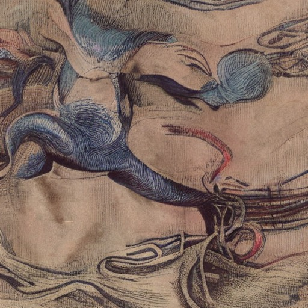
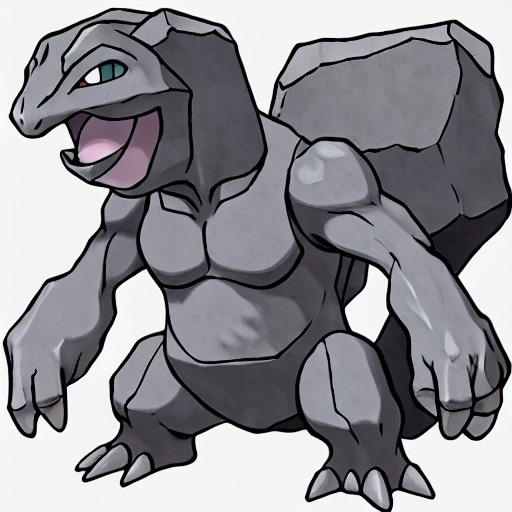

# Results

## Example 1

Prompt:

```shell
{
    "prompt": "A green and brown Pokémon of ground type. It blends in with its surroundings."
}
```

<details>
    <summary>pretrained model</summary>
    
</details>

<details open>
    <summary>finetuned model</summary>
    
</details>

## Example 2

Prompt:

```shell
{
    "prompt": "A Pokémon that launches spikes from its tail if intimidated."
}
```

<details>
    <summary>pretrained model</summary>
    
</details>

<details open>
    <summary>finetuned model</summary>
    
</details>

## Example 3

Prompt:

```shell
{
    "prompt": "This small Pokémon is not to be underestimated. It can set any attacker on fire."
}
```

<details>
    <summary>pretrained model</summary>
    
</details>

<details open>
    <summary>finetuned model</summary>
    
</details>

## Example 4

Prompt:

```shell
{
    "prompt": "A sleek, yellow Pokémon with lightning bolt patterns on its body, sharp ears, and an electrifying aura."
}
```

<details>
    <summary>pretrained model</summary>
    
</details>

<details open>
    <summary>finetuned model</summary>
    
</details>

## Example 5

Prompt:

```shell
{
    "prompt": "A graceful, blue Pokémon resembling a dolphin, with smooth skin, fins, and a sparkling wave trailing behind it."
}
```

<details>
    <summary>pretrained model</summary>
    
</details>

<details open>
    <summary>finetuned model</summary>
    
</details>

## Example 6

Prompt:

```shell
{
    "prompt": "A rugged, gray Pokémon with a sturdy, boulder-like body, strong limbs, and an earthy texture."
}
```

<details>
    <summary>pretrained model</summary>
    
</details>

<details open>
    <summary>finetuned model</summary>
    
</details>

## Example 7

Prompt:

```shell
{
    "prompt": "A gentle, green Pokémon resembling a small dinosaur, with leafy fronds on its back and a peaceful expression."
}
```

<details>
    <summary>pretrained model</summary>
    
</details>

<details open>
    <summary>finetuned model</summary>
    
</details>

## Example 9

Prompt:

```shell
{
    "prompt": "A fierce, red Pokémon with flames on its back, blazing eyes, and a tail that burns like a torch."
}
```

<details>
    <summary>pretrained model</summary>
    
</details>

<details open>
    <summary>finetuned model</summary>
    
</details>